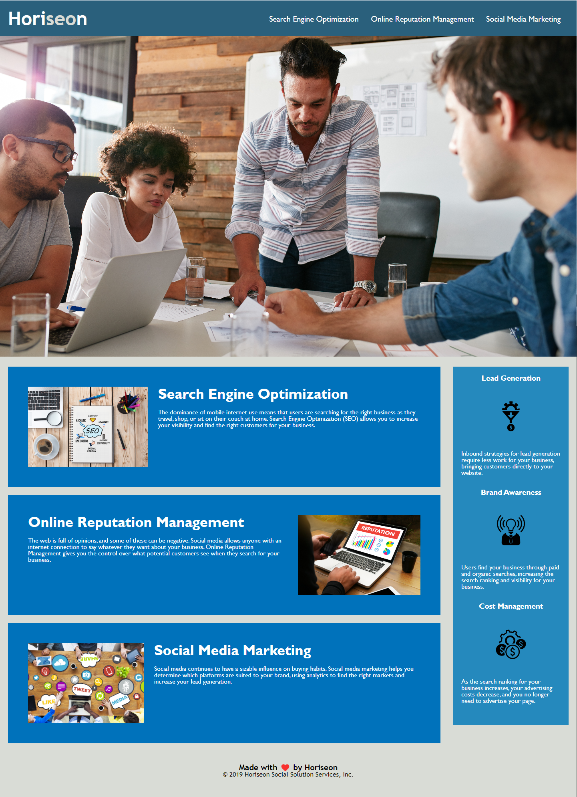

## Table of contents
​
- [Overview](#overview)
  - [The Challenge](#the-challenge)
  - [Screenshot](#screenshot)
  - [Links](#links)
- [My process](#my-process)
  - [Built with](#built-with)
  - [What I learned](#what-i-learned)
  - [Continued development](#continued-development)
  - [Useful resources](#useful-resources)
- [Author](#author)
- [Acknowledgments](#acknowledgments)
​

​
## Overview
​
### **The Challenge**

​
User Story

 - AS A marketing agency
 - I WANT a codebase that follows accessibility standards
 - SO THAT our own site is optimized for search engines


Acceptance Criteria

 - GIVEN a webpage meets accessibility standards
 - WHEN I view the source code
 - THEN I find semantic HTML elements
 - WHEN I view the structure of the HTML elements
 - THEN I find that the elements follow a logical structure independent of styling and positioning
 - WHEN I view the icon and image elements
 - THEN I find accessible alt attributes
 - WHEN I view the heading attributes
 - THEN they fall in sequential order
 - WHEN I view the title element
 - THEN I find a concise, descriptive title
​
- View the optimal layout for the site depending on their device's screen size
- See hover states for all interactive elements on the page
​
### Screenshot
​

​
​
### Links
​
- Solution URL: [https://github.com/AveryCaldwell/horiseon-website-optimization](https://github.com/AveryCaldwell/horiseon-website-optimization)
- Live Site URL: [https://averycaldwell.github.io/horiseon-website-optimization/index.html](https://averycaldwell.github.io/horiseon-website-optimization/index.html)
​
## My process
​
### Built with
​
- Semantic HTML5 markup
- CSS custom properties
- Mobile-first workflow
- Git/Git pages
​
​
​
### What I learned

 - While working on this project, I learned how to use responsive design mode in Google Dev and Microsoft Edge in order to ensure the webpage formatted correctly regardless of screen size. 
 - I learned how to consolidate code in order to prevent redundant CSS and make it easier to read.
 - In regard to accessibility, I learned that adding the image alt attribute provides descriptive information for users that are unable to access the image.
```html

```
​
 - I am proud of this code because it allows the webpage to keep its functionality while resizing to standard mobile sizes.
 - I also prevented repetitive code by identifying shared factors and combining elements.

```css
@media screen and (max-width: 992px) {
  header {
    width: 100%;
    text-align: left;
  }
  header nav {
    text-align: right;
    width: 40%;
    padding-top: 0;
    position: absolute;
    top: 0;
    right: 0;
    font-size: 18px;
  }
  header nav ul li {
    padding: 5px;
  }
  .hero,
  .content {
    width: 100%;
    flex-direction: column;
    justify-content: center;
    align-items: center;
  }
  .float-left,
  .float-right {
    width: 40%;
  }
  .content-item,
  .benefit-item,
  .benefits {
    width: calc(100% - 40px);
  }
}
/* Large smartphones */
@media screen and (max-width: 768px) {
  .float-left,
  .float-right {
    width: 42%;
  }
}
/* Small smartphones  */
@media screen and (max-width: 576px) {
  header nav {
    width: 50%;
  }
}
```


​
### Continued development
​
I want to further my understanding of CSS flex and CSS grid because I think it would have better achieved what the web designer was going for when creating this webpage. I would also like to better understand menu interactions to provide a better experience for the user.


​
### Useful resources
​
- [https://www.internetingishard.com/html-and-css/semantic-html/](https://www.internetingishard.com/html-and-css/semantic-html/) - This helped me understand Semantic HTML markup. It provided an easy visual to follow and obtain a better understanding for developing web pages. 
- [https://code.tutsplus.com/tutorials/the-30-css-selectors-you-must-memorize--net-16048](https://code.tutsplus.com/tutorials/the-30-css-selectors-you-must-memorize--net-16048) - This is a great guide on learning CSS selectors.
​

​
## Author
  Avery Caldwell
- GitHub - [AveryCaldwell](https://github.com/AveryCaldwell)
​
​